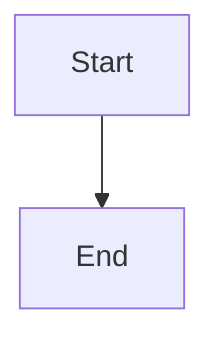
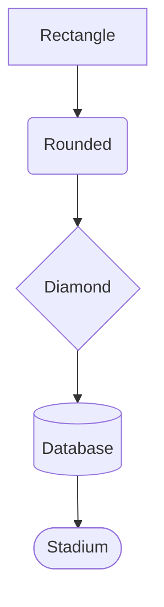
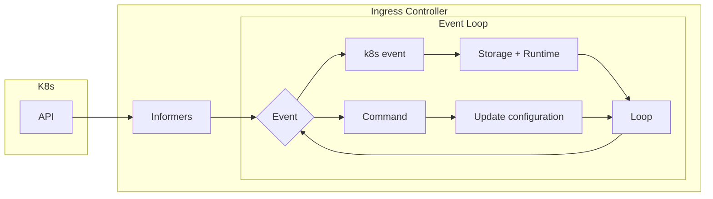
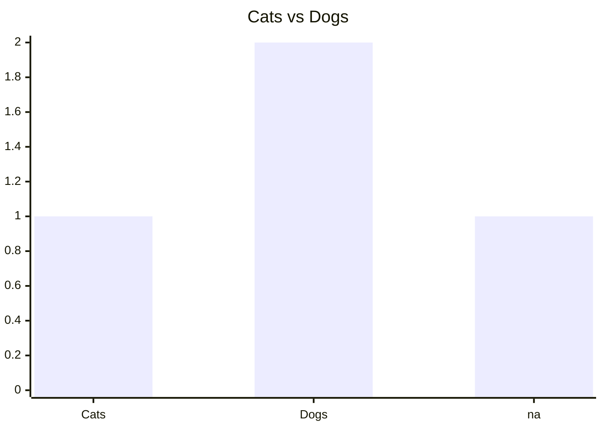
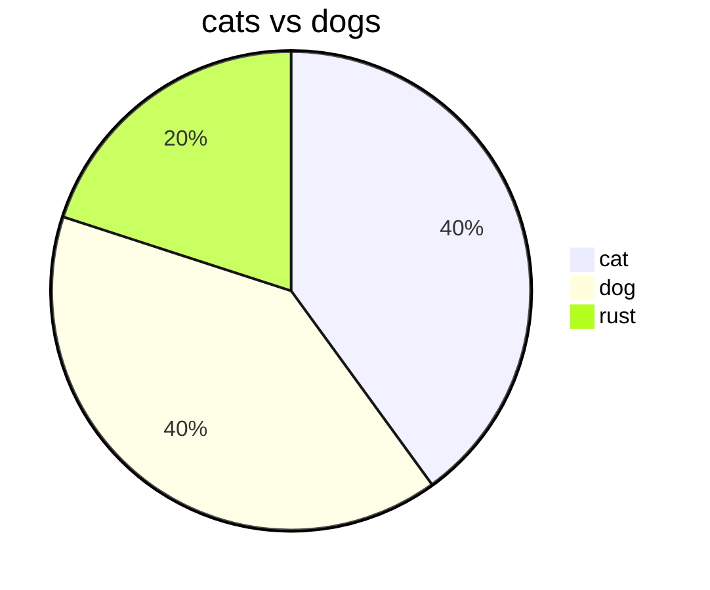
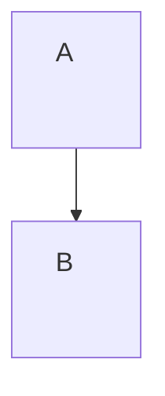

# oktalz/present — Presentation Format Reference

> **Tool**: [github.com/oktalz/present](https://github.com/oktalz/present) — Go-based CLI that renders `.present` / `.slide` files as browser-based presentations.
> Install: `go install github.com/oktalz/present@latest`

---

## Table of Contents

1. [Project Structure](#project-structure)
2. [Slide Separators](#slide-separators)
3. [Global & Slide Settings (Directives)](#global--slide-settings)
4. [Markdown Support](#markdown-support)
5. [Styling Directives](#styling-directives)
6. [Images](#images)
7. [Centering](#centering)
8. [Tables (Custom)](#tables-custom)
9. [Transitions](#transitions)
10. [Replace & Replace.After](#replace--replaceafter)
11. [Templates (Go Templates)](#templates-go-templates)
12. [Headers & Footers](#headers--footers)
13. [Notes](#notes)
14. [Code Blocks & Running Code (.cast)](#code-blocks--running-code-cast)
15. [Static Code Blocks (.block)](#static-code-blocks-block)
16. [Tabs](#tabs)
17. [Links & Navigation](#links--navigation)
18. [Graphs (Mermaid & D2)](#graphs-mermaid--d2)
19. [Icons (Boxicons)](#icons-boxicons)
20. [Raw HTML](#raw-html)
21. [Comments](#comments)
22. [Custom CSS / JS / HTML](#custom-css--js--html)
23. [Environment & Security](#environment--security)
24. [Presentation from Current Folder — Anatomy](#presentation-from-current-folder--anatomy)
25. [Quick-Start Template](#quick-start-template)

---

## Project Structure

```
my-presentation/
├── .global.present      # Global settings (applied to all slides)
├── .templates.present   # Template definitions (reusable blocks)
├── .replace.present     # Replacement macros
├── 01.intro.present     # Slides — ordered by filename
├── 02.main.present      # More slides
├── x.thank-you.present  # 'x' prefix → sorts last
├── present.css          # Custom CSS (auto-loaded)
├── present.js           # Custom JS (auto-loaded, e.g. slide animations)
├── present.html         # Custom HTML (auto-loaded)
├── present.env          # Environment config
├── .env                 # Environment config (overrides)
└── assets/              # Images, SVGs, etc.
```

- **File extensions**: `.present` or `.slide`
- **File ordering**: Alphabetical by filename (hence `01.`, `02.`, `x.` prefixes)
- **Prefix convention**: Dot-files (`.global`, `.templates`, `.replace`) are "utility" files, not really slides
- All `.present`/`.slide` files in the directory are concatenated (separated by `.===`) then parsed as one presentation

---

## Slide Separators

Each slide is separated by a delimiter line (must start a line):

```
.===            ← slide break (3+ equals signs after the dot)
.---            ← slide break (3+ dashes after the dot)
.=============== ← also valid (more chars for readability)
```

Everything between two separators is **one slide**.

---

## Global & Slide Settings

Settings prefixed with `.global` apply to **all** subsequent slides. Settings prefixed with `.slide` apply only to the **current** slide.

| Directive | Scope | Example |
|---|---|---|
| `.title(text)` | global | `.title(My Presentation)` — browser tab title |
| `.author(text)` | global | `.author(John Doe)` |
| `.global.font-size(val)` | global | `.global.font-size(5svh)` |
| `.slide.font-size(val)` | slide | `.slide.font-size(4.3svh)` |
| `.global.background-color(color)` | global | `.global.background-color(#FFFFFF)` |
| `.slide.background-color(color)` | slide | `.slide.background-color(black)` |
| `.global.background(path)` | global | `.global.background(assets/bg.png)` |
| `.slide.background(path)` | slide | `.slide.background(assets/intro.png)` |
| `.global.aspect-ratio(WxH)` | global | `.global.aspect-ratio(16x9)` |
| `.global.aspect-ratio-min(WxH)` | global | `.global.aspect-ratio-min(16x9)` |
| `.global.aspect-ratio-max(WxH)` | global | `.global.aspect-ratio-max(16x10)` |
| `.global.disable.aspect-ratio` | global | Disables aspect ratio |
| `.global.hide.page.number` | global | Hides page numbers on all slides |
| `.slide.hide.page.number` | slide | Hides page number on current slide |
| `.global.show.page.number` | global | Shows page numbers |
| `.global.hide.run.button` | global | Hides the "Run" button |
| `.slide.hide.run.button` | slide | Hides "Run" on current slide |
| `.global.keep.page.print.on.transition` | global | Keeps page in print on transition |
| `.slide.keep.page.print.on.transition` | slide | Same, slide-level |
| `.slide.enable.overflow` | slide | Allows content to overflow slide |
| `.slide.title(text)` | slide | Slide title (for menu navigation) |
| `.slide.css{css}` | slide | Extra CSS for this slide |
| `.slide.class{class}` | slide | Extra CSS class for this slide |
| `.global.dash.is.transition` | global | Makes `-` list items trigger transitions |
| `.slide.dash.is.transition` | slide | Same, slide-level |
| `.slide.dash.disable.transition` | slide | Disables dash-as-transition |

**Recommended units**: Use `svw` (viewport width) and `svh` (viewport height) for responsive sizing — these are relative to the slide viewport.

---

## Markdown Support

Standard CommonMark + GFM (GitHub Flavored Markdown):

```markdown
**Bold**          → <strong>
*Italics*         → <em>
`code`            → <code>
~~strikethrough~~ → <del>
[link](url)       → <a>
       → 

# Heading 1
## Heading 2
### Heading 3

- Bullet
  - Nested

| Table | Header |
|-------|--------|
| cell  | cell   |
```

Also supports:
- **Emoji shortcodes**: `:joy: :star: :+1:` → 😂 ⭐ 👍
- **Unicode emoji** directly: 🎉 🔥 ✅
- **Mermaid diagrams** in fenced code blocks (```mermaid)
- **D2 diagrams** in fenced code blocks (```d2)
- **Hard wraps**: Newlines are respected (GitHub-style)

---

## Styling Directives

Three ways to apply inline CSS styles to markdown content:

### 1. `.{css}(markdown)` — inline `<span>` style
```
.{color: red}(**Red bold text**)
.{color: white; background-color: green}(**Styled**)
```
Renders as: `<span style="color: red"><strong>Red bold text</strong></span>`

### 2. `.div{css}(markdown)` — block-level `<div>` style
```
.div{font-size: 5svh; margin-bottom: 0px;}(## Title text)
```

### 3. `.css{css} ... .css.end` — multi-line block style
```
.css{
  font-size: 12svh;
  text-shadow: 0 0 3px #FFFFFF;
}
**Big styled text**
.css.end
```

### Special attributes on `.{}` and `.div{}`:
- `.class(classname)` inside the CSS string: `.{.class(myclass); color: red}(text)`
- `.id(myid)` inside the CSS string: `.{.id(myid); color: red}(text)`

---

## Images

```
.image(path width:height)
```

- `width` and `height` are optional; `auto` is default
- Use `svw`/`svh` for slide-relative sizing

```
.image(assets/photo.png 50svw:30svh)    ← fixed both
.image(assets/photo.png :100svh)         ← auto width, 100svh height (full screen)
.image(assets/photo.png 50svw:)          ← 50svw width, auto height
.image(https://example.com/img.png 25svw:25svh)  ← remote URL
```

Position absolutely with style wrapper:
```
.{position: absolute; top: 35svh; right: 15svh; transform: rotate(15deg);}(
  .image(assets/gopher.png :50svh)
)
```

---

## Centering

```
.center
Content to center
.center.end
```

Options:
- `.center.flex` — also adds `display: flex; justify-content: center; align-items: center;`
- `.center.noflex` — only `text-align: center;`

---

## Tables (Custom)

HTML-like table syntax (as alternative to markdown tables):

```
.table
{border: 1px solid black}       ← optional table style on first line
.tr
.td Row 1, Col 1
.td Row 1, Col 2
.tr{color: blue}                 ← optional row style
.td Row 2, Col 1
.td{background: yellow}         ← optional cell style on next line
Row 2, Col 2
.table.end
```

`.td` can have inline content after it, or multi-line content on following lines until the next `.td`, `.tr`, or `.table.end`.

---

## Transitions

Transitions create animation steps within the **same slide** (page number doesn't change).

### `.transition` — additive (content builds up)
```
- First point
.transition
- Second point appears
.transition
- Third point appears
```

### `.transition.clean` — replace (resets slide content)
```
# Title
Old content here
.transition.clean
# Title
New content replaces old
```

### `.transition{BEFORE}(AFTER)` — replace text via macros
```
.replace{#empty#}()
.replace{#check#}(:white_check_mark:)

- Option A #empty#
- Option B
.transition{#empty#}(#check#)
```

Multiple replacements on one transition:
```
.transition{#spinner#}(#check#).transition{#empty#}(#done#)
```

---

## Replace & Replace.After

### `.replace{KEY}(VALUE)` — immediate replacement
Applied during parsing, replaces `KEY` with `VALUE` in all slide content:

```
.replace{#space#}(&nbsp;)
.replace{#active#}(active)
.replace{#empty#}()
```

### `.replace.after{KEY}(VALUE)` — post-processing replacement
Applied after all HTML generation (useful for characters that would be consumed by markdown):

```
.replace.after{#space#}(&nbsp;)
.replace.after{#dot#}(.)
.replace.after{#amp#}(&amp;)
.replace.after{#backtick#}(`)
.replace.after{#brace#}({)
.replace.after{#div#}(&lt;div&gt;)
```

**Convention**: Use `#name#` for replace keys to make them visually distinct.

---

## Templates (Go Templates)

Templates allow reusable blocks with Go `text/template` syntax.

### Single-value template
```
.template{MYTITLE}
.{font-size: 5svh}(## {{ . }})
<hr>
.template.end

.MYTITLE{My Slide Title}
```

### Multi-value template
```
.template{GOTITLE}(Title,Extra,Last)
.{font-size: 5svh}(## {{ .Title }} - "{{ .Extra }}" {{ .Last }})
<hr>
.template.end

.GOTITLE{Title}(Templates){Extra}(Go News){Last}(\o/)
```

Template files are typically stored in `.templates.present` (dot-prefixed, loaded first).

---

## Headers & Footers

Persistent header/footer that repeats on every slide until redefined:

```
.header
.{font-size: 5svh}(## My Header Title)
<hr>
.header.end

.footer
.{position: absolute; bottom: 0; right: 0;}(.image(assets/logo.png 8svw:))
.footer.end
```

- Headers and footers are typically defined inside **templates** for reusability
- They persist across `.transition` boundaries within the same slide
- Reset with empty `.header` / `.footer` blocks

---

## Notes

Speaker notes (viewable by adding `?notes` to the URL):

```
.notes
This is a speaker note.
It can span multiple lines.
.notes.end
```

Notes are visible in a separate browser tab at `http://localhost:8080/?notes`.
Tabs sync with each other.

---

## Code Blocks & Running Code (.cast)

### Basic code display (standard markdown)
````markdown
```go
func main() {
    fmt.Println("hello world")
}
```
````

### Runnable code with `.cast`
The `.cast` directive makes code editable and executable:

```
.cast.stream.edit.save(main.go).run(go run .).before(go mod init x)
```go
package main

import "fmt"

func main() {
    fmt.Println("hello world")
}
```
```

**`.cast` options** (chain with dots):

| Option | Description |
|---|---|
| `.stream` | Stream output in real-time |
| `.edit` | Make code editable in browser |
| `.save(filename)` | Save code to file before running |
| `.run(command)` | Command to execute |
| `.before(command)` | Run command before (e.g., `go mod init x`) |
| `.after(command)` | Run command after |
| `.parallel(command)` | Run in parallel |
| `.show(from:to)` | Show only lines `from` to `to` (1-indexed) |
| `.path(dir)` | Execute in a specific directory |
| `.lang(lang)` | Force syntax highlighting language |
| `.id(id)` | HTML id for the code block |
| `.js(code)` | Run JS after execution |
| `.env(VAR=val)` | Set environment variable |
| `.source(file)` | Load code from file |
| `.url(url)` | Download code from URL |
| `.endpoint(name)` | Create API endpoint |

**Folder syntax in commands**: `{foldername}command args` — runs in a subfolder.
```
.before({myproject}go mod init x)
```

**Show partial code**:
```
.cast.edit.save(main.go).run(go run .).before(go mod init x).show(8:8)
```
Only shows line 8 in the display (full code still runs).

### Cast template (common pattern)
```
.template{CAST}
.cast.stream.edit.save(main.go).run(go run .).before(go mod init x)
.template.end

.CAST
```go
package main

import "fmt"

func main() {
    fmt.Println("hello world")
}
```
```

### Execute without showing code
```
.cast.path(hello-world).run(go run .)
```

---

## Static Code Blocks (.block)

Display code from a file (non-runnable):

```
.block.path(graphs).source(k8sIC.mermaid).lang(mermaid)
```

Options: `.path(dir)`, `.source(file)`, `.lang(lang)`, `.id(id)`

---

## Tabs

Create tabbed content sections:

```
.tabs
.tab{active}(Tab 1 Title)
Content for tab 1

.tab(Tab 2 Title)
Content for tab 2

.tab(Tab 3 Title)
Content for tab 3
.tabs.end
```

- `{active}` marks the initially visible tab
- Combine with `.replace` and `.transition` to switch tabs dynamically:

```
.replace{#tab1#}(active)
.replace{#tab2#}()

.tabs
.tab{#tab1#}(First Tab)
...
.tab{#tab2#}(Second Tab)
...
.tabs.end

.transition{#tab1#}().transition{#tab2#}(active)
```

---

## Links & Navigation

### Clickable navigation links
```
.link{#page1#}(Click me)
```
Creates a clickable span that navigates to the slide tagged with that link.

### Slide linking
```
.slide.link(#myid#)
.slide.link.next(#nextid#)
.slide.link.previous(#previd#)
```

### Full branching example
```
.slide.link(#link0#)
.slide.link.next(#linkNothing#)

pick :cat: or :dog:
.link{#link1#}(:cat:) .link{#link2#}(:dog:)

.===
.slide.link(#link1#)
.slide.link.next(#link3#)
.div{font-size: 55svh; text-align:center;}(:cat:)

.===
.slide.link(#link2#)
.slide.link.previous(#link0#)
.slide.link.next(#link3#)
.div{font-size: 55svh; text-align:center;}(:dog:)
```

### `.run{block}(...)` — clickable run trigger
```
.run{block-id}(Run This Code)
```
Creates a clickable element that runs a code block.

### `.api.pool.poolid{option}` — clickable API trigger
```
.api.pool.1{Click to trigger}
```

---

## Graphs (Mermaid & D2)

### Mermaid diagrams — inline

Use a fenced code block with the `mermaid` language tag:

````markdown

````

#### Graph directions

| Keyword | Direction |
|---|---|
| `graph TD` | Top → Down |
| `graph BT` | Bottom → Top |
| `graph LR` | Left → Right |
| `graph RL` | Right → Left |

#### Node shapes

````markdown

````

| Syntax | Shape |
|---|---|
| `id[Label]` | Rectangle |
| `id(Label)` | Rounded rectangle |
| `id{Label}` | Diamond (rhombus) |
| `id[(Label)]` | Cylinder (database) |
| `id([Label])` | Stadium (pill) |

#### Subgraphs

````markdown

````

#### Arrow types

| Syntax | Meaning |
|---|---|
| `A --> B` | Solid arrow |
| `A --- B` | Solid line (no arrow) |
| `A -.- B` | Dotted line |
| `A -.-> B` | Dotted arrow |
| `A ==> B` | Thick arrow |
| `A --text--> B` | Arrow with label |
| `A -->|text| B` | Arrow with label (alt) |

#### Mermaid charts (xychart-beta)

````markdown

````

#### Mermaid pie charts

````markdown

````

#### Mermaid theme configuration

Use a `%%{init: ...}%%` directive to set theme and variables:

````markdown

````

Available themes: `default`, `dark`, `forest`, `neutral`.

### Mermaid diagrams — from file

Store the diagram in a separate file (e.g. `graphs/k8sIC.mermaid`) and load it with `.block`:

```
.block.path(graphs).source(k8sIC.mermaid).lang(mermaid)
```

- `.path(dir)` — subdirectory containing the file
- `.source(file)` — filename to load
- `.lang(mermaid)` — force syntax highlighting; **not needed if the file extension matches** (`.mermaid`)

Wrapping with size constraints:
```
.center
.css{width: 48svw; overflow: hidden; font-size: 4svh!important;}
.block.path(graphs).source(k8sIC.mermaid).lang(mermaid)
.css.end
.center.end
```

### D2 diagrams

````markdown
```d2
x -> y -> z
```
````

Or load from file:
```
.block.path(graphs).source(scheduler.d2)
```

---

## Icons (Boxicons)

Integrated [Boxicons](https://boxicons.com/) support:

```
.bx{bx-info-circle}
.bx{bx-check}
.bx{bx-loader-circle bx-spin}
.bx{bxl-graphql}
```

Combine with styles:
```
.{color:red}(.bx{bx-info-circle})
.{color:green}(.bx{bx-check})
```

Rotation:
```
.bx{bx-loader-circle rotate-cw}
.bx{bx-loader-circle rotate-ccw}
```

---

## Raw HTML

### Inline raw
```
.raw{<br><br>&nbsp;&nbsp;}
```

### Multi-line raw
```
.raw
<div style="custom: html">Content</div>
.raw.end
```

Useful for injecting HTML that markdown would otherwise escape.

---

## Comments

```
.// This is a comment, not visible anywhere
```

---

## Custom CSS / JS / HTML

Place these files in the presentation directory — they are auto-loaded:

### `present.css`
```css
.tab button.active {
    background-color: #5DC9E2;
}
hr {
    border: 0.25svh solid #5DC9E2;
}
```

### `present.js`
```javascript
// Custom slide animations
slideAnimationTime = 2500;
easingType = 'easeInOutCubic';
```

### `present.html`
Additional HTML injected into the page.

---

## Environment & Security

### `present.env` or `.env`
```env
ADMIN_PWD=AdminPassword123
ADMIN_PWD_DISABLE=true
USER_PWD=present
PORT=8080
NEXT_PAGE=ArrowRight,ArrowDown,PageDown,Space
PREVIOUS_PAGE=ArrowLeft,ArrowUp,PageUp
TERMINAL_CAST=r,b
TERMINAL_CLOSE=c
MENU=m
OPTIONS=o
```

### Key Security Flags
- `ADMIN_PWD` — required to execute code from slides
- `ADMIN_PWD_DISABLE=true` — removes password requirement
- `USER_PWD` — required to view the presentation
- `--any-user` flag — allows any user without password

### CLI
```sh
present                          # Serve from current directory
present -d /path/to/slides      # Serve from specific directory
present -g github.com/user/repo # Clone and serve from git repo
present -c name.tar.gz          # Compress presentation for sharing
present -f name.tar.gz          # Open compressed presentation
```

### Browser Paths
- `/` — Presentation view
- `/print` — Print-friendly view (no forced aspect ratio)
- `/login` — Admin login
- `/stats` — View statistics

---

## Presentation from Current Folder — Anatomy

The `circus/` presentation demonstrates a real-world structure:

```
circus/
├── .global.present        ← Global: title, font-size, hide page numbers, aspect ratio
├── .templates.present     ← Templates: MEETUP_TITLE, TITLE, TITLEALT, CAST, FOOTER, TITLE2
├── .replace.present       ← Replacements: tab states, special chars, HTML entities
├── 1.intro.present        ← Intro slides: title card, contact info, about me
├── 2.main-topic.present   ← Content slides: fallacies with strike-through transitions
├── x.thank-you.present    ← Closing slide (sorted last via 'x' prefix)
├── present.css            ← Custom styling (tab colors, header borders, backgrounds)
├── present.fade.js        ← Custom slide animation (fade transitions)
├── present.html           ← Empty (no extra HTML)
├── anime.umd.min.js       ← Animation library
└── assets/                ← Images: logos, social icons, backgrounds
```

**Key pattern used**: The `.transition.clean` pattern for "fallacy reveal" slides:
```
.TITLEALT{Fallacies in business}

A technical solution is the most important!
.transition.clean

.TITLEALT{Fallacies in business}

~~A technical solution is the most important!~~
Value produced for the customer is!
```

---

## Quick-Start Template

### Minimal presentation

```
.global.font-size(5svh)
.global.aspect-ratio(16x9)
.title(My Talk)
.global.hide.page.number

.replace.after{#space#}(&nbsp;)
.replace.after{#dot#}(.)

.===============================================================================
#space#

.center
.css{font-size: 12svh;}
**My Presentation Title**
.css.end
.center.end

.center
.css{font-size: 6svh;}
Subtitle goes here
.css.end
.center.end

.===============================================================================
## First Slide

- Point one
- Point two
- Point three

.===============================================================================
## Second Slide

Content here with **bold** and *italics*

.===============================================================================
.center
.css{font-size: 18svh;}
**Thank you!** 😊
.css.end
.center.end
```

### Presentation with templates, header/footer, and runnable code

```
.global.font-size(5svh)
.global.aspect-ratio(16x9)
.title(Go Presentation)
.global.hide.page.number

.replace.after{#space#}(&nbsp;)
.replace.after{#dot#}(.)

.template{TITLE}
.header
.css{font-size: 5svh; margin-bottom: 0px!important; margin-left: 2svw;}(## {{ . }})
<hr>
.header.end
.footer
.div{position: absolute; right: 2svw; bottom: 0; font-size: 3svh; color: gray;}(My Meetup)
.footer.end
.template.end

.template{CAST}
.cast.stream.edit.save(main.go).run(go run .).before(go mod init x)
.template.end

.===============================================================================
#space#
.center
.css{font-size: 14svh; text-shadow: 0 0 15px rgba(255,255,255,1);}
**Go Talk**
.css.end
.center.end
.slide.background(assets/intro.png)

.===============================================================================
.TITLE{Hello World}

.CAST
```go
package main

import "fmt"

func main() {
    fmt.Println("Hello, World!")
}
```

.===============================================================================
.TITLE{Thank you!}

.center
.css{font-size: 18svh;}
**Thank you!** 😊
.css.end
.center.end
```

Save as `01.intro.present` and run `present` in the directory.

---

## Summary of All Dot-Directives

| Directive | Purpose |
|---|---|
| `.===` / `.---` | Slide separator |
| `.//` | Comment |
| `.title(text)` | Browser tab title |
| `.author(text)` | Author name |
| `.global.*` | Global settings |
| `.slide.*` | Per-slide settings |
| `.center` / `.center.end` | Center content |
| `.{css}(md)` | Inline `<span>` style |
| `.div{css}(md)` | Block `<div>` style |
| `.css{css}` / `.css.end` | Multi-line styled block |
| `.image(path w:h)` | Image |
| `.table` / `.table.end` | Custom table |
| `.tr` | Table row |
| `.td` | Table cell |
| `.transition` | Additive transition |
| `.transition.clean` | Replace transition |
| `.transition{X}(Y)` | Macro replace on transition |
| `.replace{X}(Y)` | Text replacement |
| `.replace.after{X}(Y)` | Post-processing replacement |
| `.template{NAME}` / `.template.end` | Define template |
| `.NAME{val}` | Use template |
| `.header` / `.header.end` | Persistent header |
| `.footer` / `.footer.end` | Persistent footer |
| `.notes` / `.notes.end` | Speaker notes |
| `.cast` | Runnable code block |
| `.block` | Static code block from file |
| `.tabs` / `.tabs.end` | Tabbed content |
| `.tab` | Individual tab |
| `.link{X}(text)` | Navigation link |
| `.run{X}(text)` | Clickable run trigger |
| `.bx{icon}` | Boxicon icon |
| `.raw{text}` / `.raw`/`.raw.end` | Raw HTML injection |
| `.style "css"` | Style block (older syntax) |
| `.admin` / `.admin.end` | Admin-only content |
| `.execute(cmd)` | Execute shell command on load |
| `.download(url)` | Download file on load |
